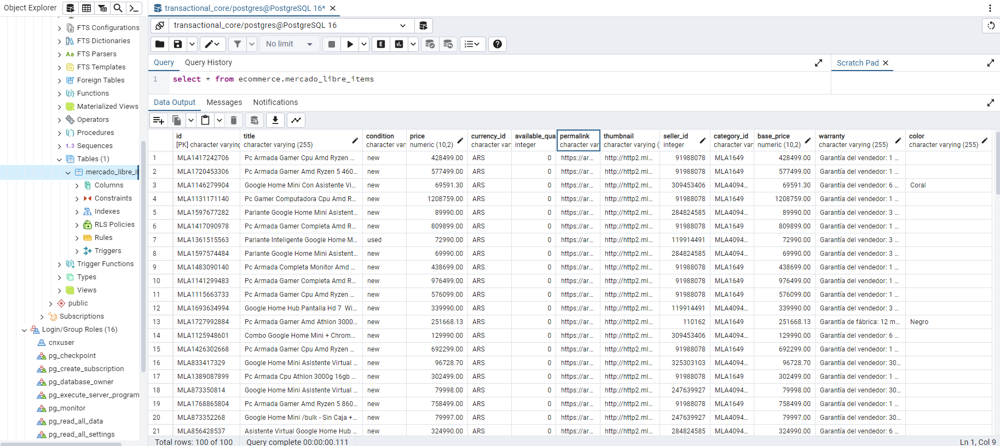

# Consumo de API para análisis de productos en Mercado Libre

Este proyecto se centra en el consumo de la API pública de MercadoLibre para realizar un análisis de la oferta de productos en diversas categorías, para este proyecto se proponen las categorias: Xbox, Nintendo, PC gaming y Playstation. El objetivo es **obtener datos** relevantes sobre estos productos, desnormalizarlos y almacenarlos en un formato accesible(archivo plano) para facilitar su análisis posterior.

Sin embargo, también se propone guardar estos datos en una base de datos PostgreSQL para garantizar la persistencia y robustez. Esto es fundamental, ya que el uso de un archivo CSV como fuente de datos para alimentar un dashboard no es una buena práctica cuando se evalúa a escala. Al almacenar los datos en una base de datos, se mejora la eficiencia y la capacidad de manejo de grandes volúmenes de información, asegurando un flujo de datos más fiable y escalable para el análisis y la visualización

## API 
El primer paso es analizar la API de mercado libre, entender las estructuras de datos que contiene para diseñar el proceso de extracción de datos. Este proceso de extracción de datos debe deivirse en dos fases acorde con los recursos de la API: endpoint para acceder a los items_id t endpoint para acceder a los detalles de los items. 

1. **ml_search_endpoint:** La [API de búsqueda de Mercado Libre](https://api.mercadolibre.com/sites/MLA/search?q=chromecast&limit=50#json) devuelve un JSON estructurado que contiene los resultados de una búsqueda en el sitio; la estructura principal del JSON está organizada en varios campos clave que proporcionan información sobre los resultados de la búsqueda. Es clave que el campo **results** porque proporciona una lista de objetos que representan los ítems encontrados. 

2. **ml_item_endpoint:** La [API de detalles de ítems de  Mercado Libre](https://api.mercadolibre.com/items/{Item_Id}) recibe como path paramether el id de un item y devuelve el detalle del item en formato JSON de donde se pueden extraer diferentes caracteristicas. Este proceso se hace uno a uno, es decir, item por item. 

## Extracción de datos

### Obtener ids de los items
La funcion `get_item_ids` obtiene una lista de item_ids desde el [endpoint de búsqueda de Mercado libre](https://api.mercadolibre.com/sites/MLA/search?q=chromecast&limit=50#json) basandose en unos términos de búsqueda proporcionados. Para este proyecto fueron seleccionados los términos: 

```
- Google Home, Apple Tv y Amazon Fire Tv: Relacionados con dispositivos para TV
- PlayStation, Xbox, Nintendo y PC Gaming: Relacionados con consolas y videojuegos
```
1. Para obtener la lista de items_id se construye la **URL para realizar la solicitud al API**. Esta usa el [endpoint](https://api.mercadolibre.com/sites/MLA/search?q=chromecast&limit=50#json), el término de búsqueda y el limite (***La API tiene una limitante de 50 items maximo por consulta***).

2. Con la url construida se emplea la función **.get()** de la libreria **request** para enviar la solicitud HTTP GET, cuando la solicitud HTTP GET es existosa es decir, el status_code == 200 se captura la respuesta del servidor en un objeto *Response*. Este objeto encapsula la información de a respuesta HTTP y proporcionar varias propiedades y métodos para interactuar con la data 

3. Se emplea el metodo **.json()** para decodificar el contenido de la respuesta como un JSON y se obtiene en un diccionario de Python que se usa para extraer y almacenar una **lista de items_id** o una lista vacia si no hay datos. 

### Obtener el detalle de los ítems
La función `get_item_details` obtiene los detalles de un item especifico desde el [endpoint de detalles de Mercado Libre](https://api.mercadolibre.com/items/{Item_Id}) basandose en la lista de items_ids generada por la función `get_item_ids`

1. Para obtener los detalles de un items se construye la **URL para realizar la solicitud al API**. Esta utiliza el metodo **.format()** para insertar cada uno de los item_id obtenido de la funcion `get_item_ids` y el [endpoint](https://api.mercadolibre.com/items/{Item_Id})

2. Como el procedimiento anterior, se emplea la función **.get()** para hacer una solicitud HTTP GET a la URL formateada.

3. Se convierte la respuesta en formato JSON a un diccionario de Python y se retorna. 

## Orquestación de procesos
La función principal del proyecto se encuentra en el archivo `extract_item_data.py`. Esta función invoca a las funciones que extraen los datos de la API de Mercado libre descritas anteriormente, procesa los detalles de los ítems en paralelo y almacena los resultados en un archivo CSV y en una base de datos PostgreSQL. 


El archivo `functions.py` almacena las funciones:

1. **get_items_ids()**
2. **get_items_details()**
3. **test_database_connection():** prueba la conexión a la base de datos PostgreSQL 
4. **write_to_csv():** escribe los ítems en un archivo CSV con los campos especificados(detalles)
5. **insert_into_database():** inserta los datos de los items en la base de datos PostgreSQL

El archivo `extract_item_data.py`: 

1. Llama a la funcion *test_database_connection* para verificar si se puede establecer una conexion a la base de datos
2. Define los terminos de busqueda en una lista. En este caso los relacionados con consolas y videojuegos mencionados anteriormente. 
3. Inicia una lista para almacenar los items_id y llama la funcion *get_items_id*, almacenando el return en la lista creada. Aca se obtiene la lista con los items_ids objeto del proyecto. <br> **Nota:** Durante la ejecución de este paso se estaba presentando un error porque al parecer la API puede traer el mismo item_id en diferentes búsquedas relacionadas(por el termino en el query result), para esto se agrego una función donde se eliminan los ids duplicados y evitar el error.
4. Se utiliza un **ThreadPoolExecutor** para procesar los detalles de los ítems en paralelo. Para cada item_id, se ejecuta la función get_item_details y se espera a que se completen las tareas(Es decir, el proceso de obtener el detalle para cada item). Los detalles de los ítems se agregan en una lista.<br>
**Nota:** Inicialmente, en el [primer commit](https://github.com/juanm-ot/api-etl-visualization/commit/82c3ab2068567bae2cb8b930711e4836a4012b16#diff-a37f5d29d320a8012836a2fe535b1bafef9e24461d1effd9a9decf75fd211a80), se proceso la data en un solo hilo usando un for, pero este proceso consumia mucho tiempo. Un estimado de 6 minutos para extraer la data; por esta razon, se investigo un metodo para acelerar el tiempo y optimizar la extraccion de datos.<br>
**Procesamiento en paralelo:**  Se usa la clase **ThreadPoolExecutor** de la libreria *concurrent.futures* para facilitar la ejección de tareas en paralelo. Esta clase crear un pool con 10 hilos de trabajo, este es un parametro que acepta la clase.Entonces las tareas que se envian a esta clase se distirbuyen en los 10 hilos generados, extrayendo la data de manera independiente y simultanea. ***Con este proceso se logro una optimizacion del tiempo de procesamiento de 6 minutos a 7 segundos.***
5. Se llama la funcion *write_to_csv* para generar el csv.
6. Se llama la funcion *insert_into_database* para insertar los items en la base de datos PostgreSQL <br> 


## Estructura repositorio

```linux

.
├── readme.md                          # descripcion del repositorio
├── .env                               # contiene las variables de entorno
├── mercado_libre_items.sql            # script DDL 
├── user_cnx.sql                       # contiene la confg del usuario de conexion
├── functions.py                       # funciones para conectarse a la bd, consumir la API, generar el archivo plano
├── extract_items_data.py              # orquesta las funciones para escribir los items en el archivo plano y en la bd
│
├── meli_items_hub.csv                 # output: archivo de texto plano con la data de los items
├── resources                          # carpeta para almacenar recursos de apoyo
│   └── algún-archivo
│
└── requirements.txt                   # requerimientos para correr el repositorio

```

## Adecuación del ambiente de trabajo

```
Prerrequisitos:

- PostgreSQL
- Python >= 3.7 
- Git/git bash 
```

1. Abrir una terminal de git bash
2. Otorgar permisos para la ejecución del archivo .sh con el comando `chmod +x run.sh`
3. Modificar el archivo **run.sh** e incluir en la linea 4 la ruta a la instalación de PostgreSQL en el sistema. Para el caso de este ambiente es: `"C:\Program Files\PostgreSQL\16\bin\psql.exe"`
4. Editar el archivo **.env** con los datos necesarios para conectar el bash como administrador al servidor local de base de datos. Esto permitirá la creación de la base de datos y su esquema. Además modificar el puerto y el host si es necesario.
5. Correr el archivo .sh con el comando `./run.sh`

